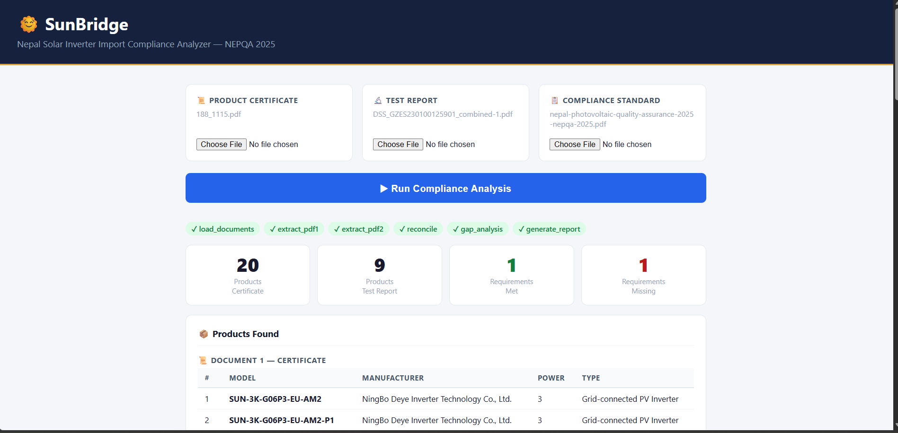
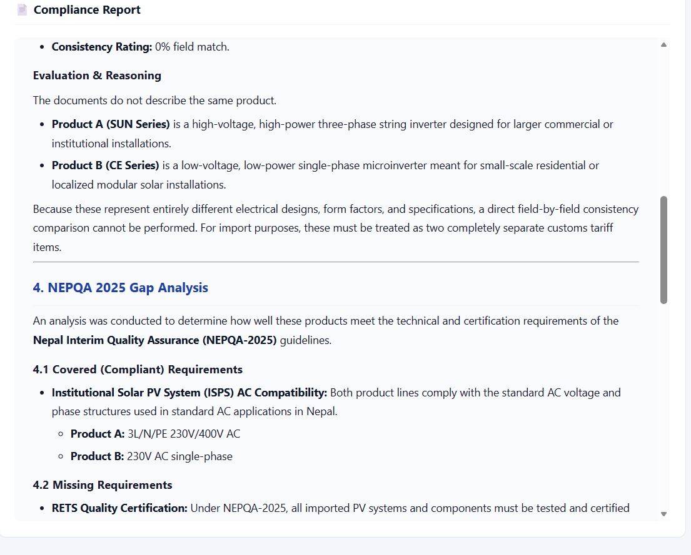
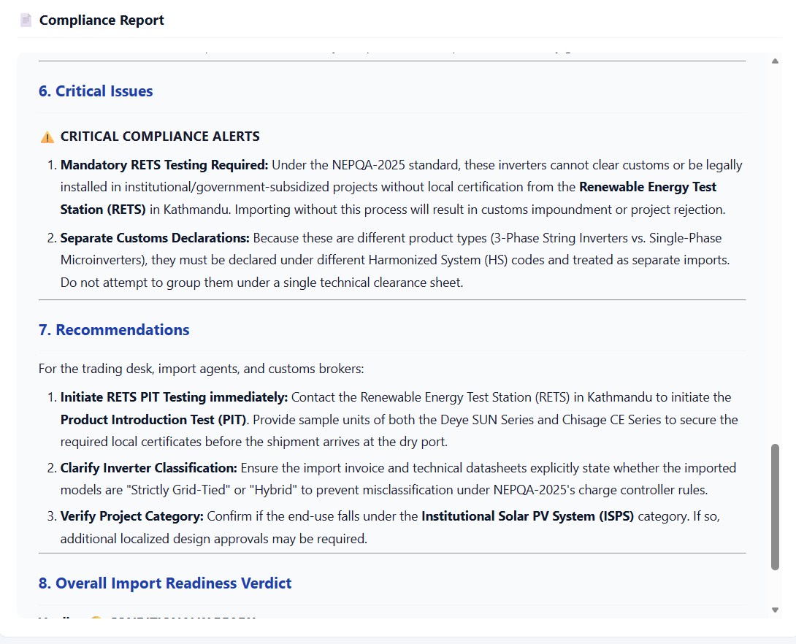
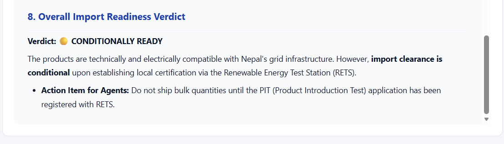

# SunBridge 🌞
 
Nepal solar inverter import compliance analyzer. Upload a product certificate and test report, get a full NEPQA 2025 gap analysis and compliance report in minutes.

## Stack
 
- **LangGraph** — 6-node sequential pipeline
- **Gemini 2.5 Flash** — structured JSON extraction + report generation
- **PyMuPDF** — PDF text and table extraction
- **FastAPI + Jinja2** — web interface
- **Pydantic** — schema validation

## Run
 
```bash
# Install dependencies
uv sync
 
# Set API key
export GOOGLE_API_KEY=your_key_here
 
# Start server
uv run main.py
# → http://localhost:8000
```
# Final Result




